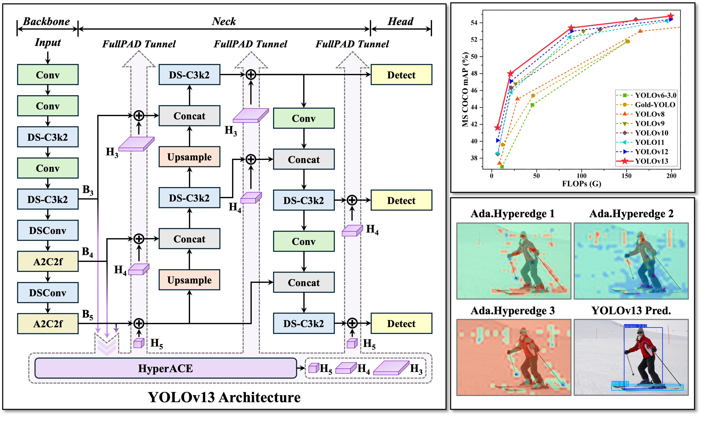

# YOLOv13-AFSS: 融合防遗忘采样策略的目标检测训练加速框架

[](https://github.com/iMoonLab/yolov13)
[](./LICENSE)
[]()
[]()

## 项目简介

本项目基于 [YOLOv13](https://github.com/iMoonLab/yolov13) 目标检测框架，集成并复现了 CVPR 2026 论文 **"Does YOLO Really Need to See Every Training Image in Every Epoch?"** 中提出的 **AFSS（Anti-Forgetting Sampling Strategy，防遗忘采样策略）**，并在此基础上进行了多项工程化改进与自适应增强，旨在为工业缺陷检测等场景提供高效的模型训练加速方案。
> 注意：本项目在重构过程中借助了 AI 助手，项目代码中可能留下明显的 AI 处理痕迹。

### 核心思想

传统训练中，每个 epoch 所有训练图像都全量参与训练。AFSS 通过评估每张图像的学习充分性，将图像分为 **Easy / Moderate / Hard** 三个难度级别，并按差异化策略进行采样：

- **Hard 图像**（模型尚未学会）→ 100% 全量参与
- **Moderate 图像**（部分掌握）→ ~40% 采样参与
- **Easy 图像**（已完全掌握）→ ~2% 采样参与

从而在不损失精度的前提下，减少每 epoch 的训练量，加速模型收敛。

<p align="center">
  
</p>

---

## 项目结构

```
yolov13_afss/
├── ultralytics/
│   ├── utils/
│   │   └── afss.py                  # [新增] AFSS 核心模块
│   │                                #   AFSSManager - 状态管理、图像分级、三级采样
│   │                                #   AFSSBatchSampler - DataLoader 适配
│   │                                #   suggest_afss_params() - 参数自动推荐
│   ├── engine/
│   │   └── trainer.py               # [修改] 训练循环集成 AFSS
│   ├── models/yolo/detect/
│   │   └── train.py                 # [修改] 新增 compute_per_image_metrics()
│   ├── data/
│   │   └── build.py                 # [修改] 支持 batch_sampler 参数
│   └── cfg/
│       └── default.yaml             # [修改] AFSS 配置项
├── assets/                          # 项目图片资源
├── train.py                         # 训练入口脚本
├── AFSS_INTEGRATION.md              # AFSS 集成技术文档（代码级）
├── AFSS_FLOW.md                     # AFSS 完整流程说明（概念级）
└── README.md                        # 本文件
```

---

## 快速开始

### 环境要求

```bash
Python >= 3.12
PyTorch >= 2.10
CUDA >= 12.0
```

### 安装

```bash
pip install -e .
```

### 启用 AFSS 训练

**方式一：自动推荐参数（推荐）**

```python
from ultralytics import YOLO

model = YOLO('cfg/models/v13/yolov13.yaml').load('yolov13n.pt')
model.train(
    data='cfg/datasets/your_data.yaml',
    epochs=300, imgsz=640, batch=16,
    afss=True,              # 启用 AFSS
    afss_auto_tune=True,    # 根据数据集规模自动推荐参数
)
```

**方式二：手动设置参数**

```python
model.train(
    data='cfg/datasets/your_data.yaml',
    epochs=3000, imgsz=640, batch=16,
    afss=True,
    afss_easy_thresh=0.95,       # Easy 阈值（充分性 ≥ 此值）
    afss_hard_thresh=0.2,        # Hard 阈值（充分性 < 此值）
    afss_moderate_ratio=0.7,     # Moderate 采样比例
    afss_update_interval=5,      # 每 5 epoch 更新一次
    afss_warmup_epochs=30,       # warmup 30 epochs
    name='train_with_afss',
)
```

**方式三：CLI 命令行**

```bash
yolo detect train model=yolov13n.pt data=your_data.yaml epochs=300 \
    afss=True afss_auto_tune=True
```

### 不启用 AFSS（默认行为，完全兼容原始 YOLOv13）

```python
model.train(data='cfg/datasets/your_data.yaml', epochs=300)
```

---

## AFSS 配置参数

| 参数 | 默认值 | 说明 |
|------|:------:|------|
| `afss` | `False` | 是否启用 AFSS |
| `afss_auto_tune` | `False` | 是否自动推荐参数 |
| `afss_easy_thresh` | `0.8` | 充分性 ≥ 此值 → Easy 图像 |
| `afss_hard_thresh` | `0.3` | 充分性 < 此值 → Hard 图像 |
| `afss_easy_ratio` | `0.02` | Easy 图像采样比例 (~2%) |
| `afss_moderate_ratio` | `0.4` | Moderate 图像采样比例 (~40%) |
| `afss_update_interval` | `5` | 状态更新间隔（epoch） |
| `afss_warmup_epochs` | `10` | AFSS 启用前的 warmup epoch 数 |

---

## 与原论文的对比改进

本项目在原论文设计的基础上进行了多项工程化改进：

| 维度 | 原论文 | 本项目 |
|------|--------|--------|
| **采样比例** | 固定值 | 手动 + 自动推荐 + warmup 后自适应，三层可叠加 |
| **自适应调参** | 无 | `adapt_ratios()` 基于真实难度分布动态修正采样比例 |
| **活跃集保护** | 无显式约束 | 强制活跃集 ≥ 25% 且 ≥ batch_size × 16 |
| **小数据集安全** | 无 | < 2000 张图像时自动禁用 AFSS |
| **检测头兼容** | 仅标准 Detect | 同时支持 `Detect` 和 `Detect_NMSFree` |
| **框架集成** | 独立训练循环 | 集成到 Ultralytics YOLO 框架 |

### 双重自适应机制

```
训练开始前                    warmup 结束后首次更新
      │                              │
      ▼                              ▼
suggest_afss_params()          adapt_ratios()
(基于假设分布估算)             (基于真实分布修正)
  afss_auto_tune=True            所有 AFSS 场景均生效
```

两层机制完全解耦，`adapt_ratios()` 作为对任何参数来源的兜底修正。

> 详细的对比说明请参阅 [AFSS_FLOW.md](./AFSS_FLOW.md) §0 章节。

---

## 训练日志示例

```
============================================================
  AFSS Auto-Tune Recommendations
============================================================
  Dataset        : 5,000 images, 10 classes
  Batch size     : 16
  Epochs         : 300
------------------------------------------------------------
  easy_ratio     : 10.2%  (sample rate for Easy images)
  moderate_ratio : 70.0%  (sample rate for Moderate images)
  update_interval: 5 epochs
  warmup_epochs  : 50 epochs
============================================================

AFSS enabled: 5000 images, easy_thresh=0.8, hard_thresh=0.3,
  easy_ratio=0.102, moderate_ratio=0.700,
  update every 5 epochs, warmup 50 epochs

...（前 50 epoch 正常训练）

AFSS: Updating image states at epoch 50...
AFSS: Easy=1200(24.0%) Moderate=2300(46.0%) Hard=1500(30.0%) MeanS=0.352
AFSS: Adapted ratios based on real distribution (Easy 1200, Moderate 2300, Hard 1500)
  easy_ratio: 0.102 → 0.085
  moderate_ratio: 0.700 → 0.620
  active set: 2,620 / 5,000 (52%)

...（后续每 epoch 活跃集约 52%，训练加速）
```

---

## 适用场景

| 数据集规模 | 推荐配置 | 预期效果 |
|-----------|---------|--------|
| **< 2,000 张** | 关闭 AFSS（`afss=False`） | 数据集太小，采样收益不明显 |
| **2,000 ~ 20,000 张** | `afss=True, afss_auto_tune=True` | 约 1.5x ~ 2x 加速 |
| **> 20,000 张** | `afss=True, afss_auto_tune=True` | 约 2x ~ 4x 加速 |

---

## 文档索引

| 文档 | 内容 |
|------|------|
| [AFSS_FLOW.md](./AFSS_FLOW.md) | 完整流程说明：核心概念、训练时间线、采样细节、与原论文对比 |
| [AFSS_INTEGRATION.md](./AFSS_INTEGRATION.md) | 集成技术文档：代码变更、函数说明、配置参数、设计注意事项 |

---

## 致谢

### YOLOv13

本项目基于 [YOLOv13](https://github.com/iMoonLab/yolov13) 目标检测框架构建。感谢 YOLOv13 团队（iMoonLab）提供的先进检测模型与开源代码，其创新的 HyperACE 注意力机制、FullPAD 全阶段对齐策略和 DS-based Blocks 设计为训练加速提供了坚实的基础。

> **YOLOv13: Real-Time Object Detection with Region-focused Enhancement**
>
> GitHub: [https://github.com/iMoonLab/yolov13](https://github.com/iMoonLab/yolov13)

### AFSS 论文

本项目的核心采样策略参考并复现了 CVPR 2026 论文 **"Does YOLO Really Need to See Every Training Image in Every Epoch?"** 中提出的 Anti-Forgetting Sampling Strategy。感谢论文作者提出的创新性思路——通过评估学习充分性来动态调整训练数据参与度，为训练加速开辟了新的研究方向。

> **Paper**: [https://arxiv.org/pdf/2603.17684](https://arxiv.org/pdf/2603.17684)

---

## 许可证

本项目遵循 [AGPL-3.0 License](./LICENSE)，与 YOLOv13 保持一致。
